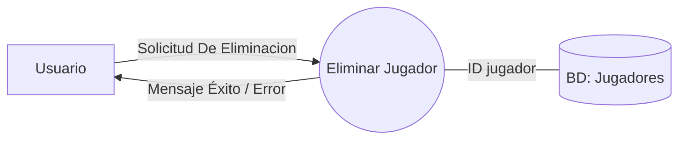

### Caso De Uso #3: Crear Jugador

### Actor Principal: Usuario

### Precondicion: El usuario debe estar autenticado en el sistema 

### Escenario Exitoso Principal: 
1. El usuario se dirige al apartado de creacion de jugadores y selecciona la opcion para crear un jugador nuevo
2. El usuario ingresa el nombre y el numero para el jugador y le asigna los valores numericos a su PACSS
3. El usuario pulsa el boton "crear"
4. El sistema valida que cada atributo del jugador se encuentre entre el rango de 20 a 100, y que la suma exacta de los cinco atributos sea 300.
5. El sistema registra al jugador en la base de datos vinculado a la cuenta del usuario y muestra un mensaje de "Jugador creado con exito".

### Escenarios Excepcionales / Alternativos: 
4.a) La sumatoria del valor de los atributos es distinto a 300 
  El sistema rechaza la creacion del jugador, mostrando un mensaje de error indicando que el total debe ser exactamente 300 y le da la cantidad de puntos restantes
  
4.b) El valor de un atributo es menor a 20 o mayor a 100 
  El sistema rechaza la creacion, mostrando un mensaje del atributo que esta fuera del rango permitido por la plataforma y le da la opcion de cambio de valor del atributo señalado
  
4.c) El numero del jugador ingresado ya pertenece a otro jugador de la cuenta. 
  El sistema rechaza la creación y solicita ingresar un número disponible


### DFD 
```mermaid
graph LR
    U[Usuario]
    P((Crear Jugador))
    DB[(BD: Jugadores)]
    
    U -->|Nombre, Dorsal y Atributos PACSS| P
    P ---|guarda jugador| DB
    P -->|Mensaje Exito / Error| U
``````


### Caso De Uso #6: Unirse A Liga Publica

### Actor Principal: Usuario

### Precondicion: El usuario debe estar autenticado en el sistema, poseer un equipo y tener seleccionados 6 jugadores  

### Escenario Exitoso Principal: 
1. El usuario se dirige al apartado de ligas y selecciona una liga publica del listado de ligas  
2. El usuario pulsa el boton "Unirse"
3. El sistema verifica que no haya alcanzado el limite de equipos inscriptos
4. El sistema registra al club del usuario como participante de la liga y muestra un mensaje de "Inscripcion exitosa".

### Escenarios Excepcionales / Alternativos: 
3.a) La liga alcanzo su limite de equipos permitidos.
  El sistema niega la inscripcion, muestra un mensaje de "Liga sin cupos disponibles" y devuelve al usuario al listado de ligas.


### DFD 
```mermaid
graph LR
    U[Usuario]
    P((Unirse a Liga))
    DB[(BD: Ligas)]
    
    U -->|Solicitud de Ingreso| P
    P ---|Ingreso a liga| DB
    DB -->|Datos de la Liga| P
    P -->|Respuesta de Solicitud| U
``````


### Caso De Uso #7: Crear Comportamiento

### Actor Principal: Usuario

### Precondicion: El usuario debe estar autenticado en el sistema 

### Escenario Exitoso Principal: 
1. El usuario se dirige al apartado de comportamiento y selecciona la opcion de crear un nuevo comportamientos
2. El usuario introduce el nombre de la tactica y redacta el codigo python dentro del editor de la plataforma
3. El usuario pulsa el boton de "Guardar"
4. El sistema debe analizar el codigo introducido por el usuario para verificar la ausencia de errores de sintaxis y confirmar que utiliza funciones permitidas
5. El sistema aprueba el codigo, registra el comportamiento en el registro personal del usuario y muestra un mensaje de "Comportamiento creado con exito"

### Escenarios Excepcionales / Alternativos: 
4.a) El codigo fuente presenta errores de sintaxis.
  El sistema aborta el guardado, muestra un mensaje de "Error de compilacion" y mantiene el codigo en pantalla para su edicion.

4.b) El codigo fuente contiene llamadas prohibidas 
  El sistema bloquea el guardado, emite una advertencia de "Operacion no permitida por seguridad" y exige la correccion del codigo.

4.c) El usuario ingresa un nombre que ya esta en uso en su catalogo.
  El sistema frena el registro, muestra un mensaje indicando que "Ya existe un comportamiento con ese nombre" y solicita ingresar uno diferente.

```mermaid
graph LR
    U[Usuario]
    P((Crear Comportamiento))
    DB[(BD: Comportamientos)]
    
    U -->|Definicion De Comportamiento| P
    P ---|Comportamiento| DB
    P -->|Mensaje Exito / Error| U  
```


### Caso De Uso #8: Eliminar Jugador

### Actor Principal: Usuario

### Precondicion: El usuario debe estar autenticado en el sistema y posser al menos un jugador creado en su cuenta

### Escenario Exitoso Principal: 
1. El usuario accede al apartado de jugadores y selecciona la accion de "eliminar" sobre un jugador especifico
2. El sistema despliega una ventana de advertencia solicitando la confirmacion de la eliminacion del jugador seleccionado
3. El usuario pulsa el boton "Confirmar"
4. El sistema verifica que el jugador no forme parte de la plantilla de un equipo que este inscripto a una liga activa en ese momento
5. El sistema borra al jugador de la base de datos de forma permanente, actualiza la seccion de jugadores y muestra un mensaje de "Jugador eliminado con exito".

### Escenarios Excepcionales / Alternativos: 
3.a) El usuario pulsa el boton de "Cancelar" o cierra la ventana de advertencia.
El sistema aborta el proceso, oculta la advertencia y el jugador permanece intacto en la cuenta del usuario.

4.a) El jugador se encuentra actualmente inscripto en una liga activa.
El sistema bloquea la eliminacion, muestra un mensaje de "Accion denegada: El jugador no puede ser eliminado mientras participe en una competicion" y cancela el proceso.





