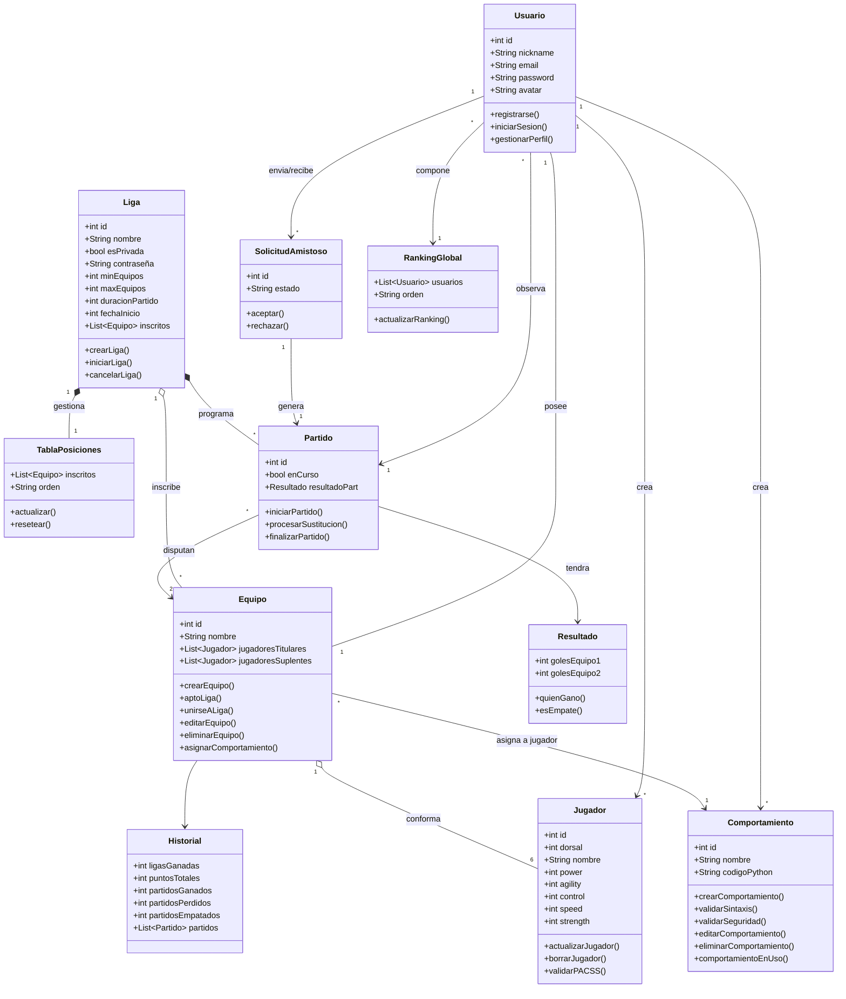

# DIAGRAMA DE CLASES

# Diccionario de clases

### 1. Entidades Principales

| Entidad | Campo | Tipo de Dato | Descripción |
| :--- | :--- | :--- | :--- |
| **Usuario** | `user_id` | Integer | Identificador único autogenerado. |
| **Usuario** | `username` , `email` , `password` | String | Credenciales de acceso únicas. |
| **Usuario** | `created_at` | Datetime | Fecha y hora de registro. |
| **Jugador** | `player_id` , `team_id` , `shirt_numb` | Integer | IDs de relación y dorsal. |
| **Jugador** | `pacss_attributes` | Object | Valores numéricos enteros de *power*, *agility*, *control*, *speed* y *strength*. |
| **Equipo** | `jugadores_titulares` / `suplentes` | Array | Lista de objetos vinculando `player_id` y `behavior_id`. |

---

### 2. Entidades de Competición

| Entidad | Campo | Tipo de Dato | Descripción |
| :--- | :--- | :--- | :--- |
| **Liga** | `is_private` | Boolean | Define si requiere contraseña de acceso. |
| **Liga** | `min_teams` , `max_teams` , `duration` | Integer | Reglas numéricas y cupos. |
| **Partido** | `home_team_id` , `away_team_id` | Integer | Equipos contrincantes. |
| **Partido** | `scheduled_at` | Datetime | Fecha programada para el inicio automático. |
| **Amistoso** | `status` | String | Estado de la solicitud (ej: `"pedniente"`, `"aceptada"`, `"rechazada"`). |

---

### 3. Entidades de Comportamiento

| Entidad | Campo | Tipo de Dato | Descripción |
| :--- | :--- | :--- | :--- |
| **Behavior** | `behavior_id` | Integer | Identificador de la táctica. |
| **Behavior** | `name` | String | Nombre descriptivo asignado por el usuario. |
| **Behavior** | `code` | String | Bloque de texto que almacena el script en Python. |
