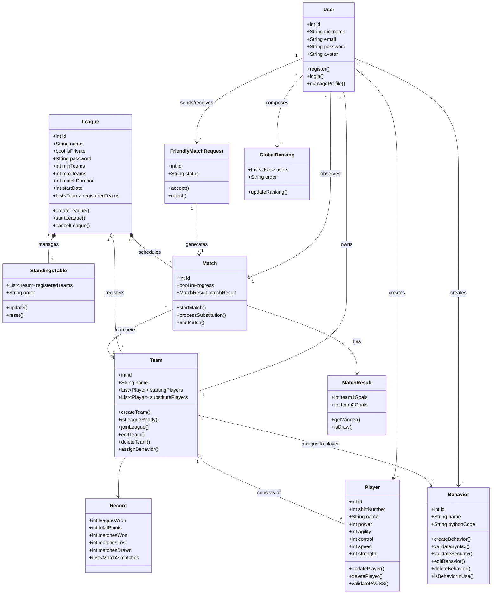

# CLASS DIAGRAM

# Data Dictionary

### 1. Core Entities

| Entity | Field | Data Type | Description |
| :--- | :--- | :--- | :--- |
| **User** | `user_id` | Integer | Unique auto-generated identifier. |
| **User** | `username`, `email`, `password` | String | Unique access credentials. |
| **User** | `created_at` | Datetime | Date and time of registration. |
| **Player** | `player_id`, `team_id`, `shirt_numb` | Integer | Relational IDs and shirt number. |
| **Player** | `pacss_attributes` | Object | Integer numerical values for *power*, *agility*, *control*, *speed*, and *strength*. |
| **Team** | `starting_players` / `substitutes` | Array | List of objects linking `player_id` and `behavior_id`. |

---

### 2. Competition Entities

| Entity | Field | Data Type | Description |
| :--- | :--- | :--- | :--- |
| **League** | `is_private` | Boolean | Defines if a password is required for access. |
| **League** | `min_teams`, `max_teams`, `duration` | Integer | Numerical rules and capacity. |
| **Match** | `home_team_id`, `away_team_id` | Integer | Opposing teams. |
| **Match** | `scheduled_at` | Datetime | Scheduled date for automatic start. |
| **Friendly Match** | `status` | String | Status of the request (e.g., `"pending"`, `"accepted"`, `"rejected"`). |

---

### 3. Behavior Entities

| Entity | Field | Data Type | Description |
| :--- | :--- | :--- | :--- |
| **Behavior** | `behavior_id` | Integer | Tactic identifier. |
| **Behavior** | `name` | String | Descriptive name assigned by the user. |
| **Behavior** | `code` | String | Text block storing the Python script. |
