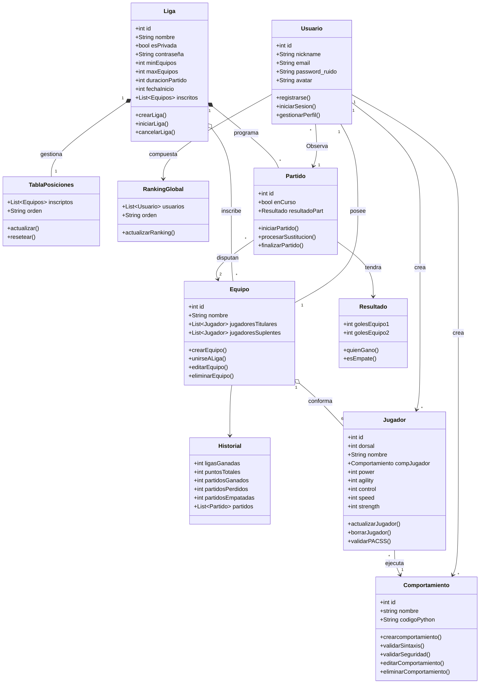

```mermaid
classDiagram
    class Usuario {
        +int id
        +String nickname
        +String email
        +String password_ruido
        +String avatar

        +registrarse()
        +iniciarSesion()
        +gestionarPerfil()
    }

    class Equipo {
        +int id
        +String nombre
        +List~Jugador~ jugadoresTitulares
        +List~Jugador~ jugadoresSuplentes
        
        +crearEquipo()
        +unirseALiga()
        +editarEquipo()
        +eliminarEquipo()
    }
    
    class Historial{
        +int ligasGanadas
        +int puntosTotales
        +int partidosGanados
        +int partidosPerdidos
        +int partidosEmpatadas
        +List~Partido~ partidos
    }

    class Jugador {
        +int id
        +int dorsal
        +String nombre
        +Comportamiento compJugador
        +int power
        +int agility
        +int control
        +int speed
        +int strength

		+actualizarJugador()
		+borrarJugador()
        +validarPACSS()
    }

    class Comportamiento {
        +int id
        +string nombre
        +String codigoPython

        +crearcomportamiento()
        +validarSintaxis()
        +validarSeguridad()
        +editarComportamiento()
        +eliminarComportamiento()
    }

    class Liga {
        +int id
        +String nombre
        +bool esPrivada
        +String contraseña
        +int minEquipos
        +int maxEquipos
        +int duracionPartido
        +int fechaInicio
        +List~Equipos~ inscritos

        +crearLiga()
        +iniciarLiga()
        +cancelarLiga()
    }

    class TablaPosiciones {
        +List~Equipos~ inscriptos
        +String orden

        +actualizar()
        +resetear()
    }

    class RankingGlobal {
        +List~Usuario~ usuarios
        +String orden

        +actualizarRanking()

    }

    class Partido {
        +int id
        +bool enCurso 
        +Resultado resultadoPart

        +iniciarPartido()
        +procesarSustitucion()
        +finalizarPartido()
    }

    class Resultado {
        +int golesEquipo1
        +int golesEquipo2

        +quienGano()
        +esEmpate()
    }

    Usuario "1" -- "1" Equipo : posee
    Usuario "1" --> "*" Comportamiento : crea
    Usuario "*" --> "1" Partido: Observa
    Usuario "1" --> "*" Jugador: crea

    Equipo "1" o-- "6" Jugador : conforma
    Equipo --> Historial
    Jugador "*" --> "1" Comportamiento : ejecuta

    Liga "1" o-- "*" Equipo : inscribe
    Liga "1" *-- "1" TablaPosiciones : gestiona
    Liga "1" *-- "*" Partido : programa

    Partido "*" --> "2" Equipo : disputan

    Partido --> Resultado: tendra

    Usuario --> RankingGlobal: compuesta
    
```
