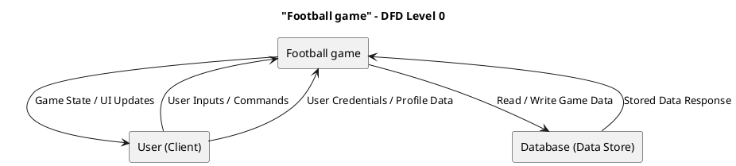


```plantuml
title DFD Level 1 - System Overview \n Core Functions

' External Entity
rectangle "User" as User

' Processes (Functions)

usecase "1.0\nUser/Profile Managment" as P1
usecase "2.0\nTeam Management" as P2
usecase "3.0\nLeague and Matches Engine" as P3
usecase "4.0\nBots and Behaviors Engine" as P4

' Data Store 
database "D1: User DB" as DB1
database "D2: Teams &\n Players DB" as DB2
database "D3: Matches DB" as DB3
database "D4: Bots DB" as DB4

User --> P1 : User Credentials\n(e.g., Emails, \nPasswords, Usernames)
P1 <--> DB1 : Read/Write User Data

User --> P2 : Team Data\n(Team names, PACSS, \nPlayers, Team-specific stats)
P2 <--> DB2 : Read/Write Teams \n& Players Data

User --> P3 : League Data\n(League names, Leaderboards, \nFixtures, Matches)
P3 <--> DB3 : Read/Write Leagues \n& Matches Data

User --> P4 : Bot Data\n(Behaviors, Python Scripts, \nPython Syntax Verifier) 
P4 <--> DB4 : Read/Write Bot \n& Behavior Data

P1 --> DB1
P2 --> DB2
P3 --> DB3
P4 --> DB4
```

```plantuml
title "DFD Level 2 - User/Profile Management"

rectangle "User" as User
usecase "1.1\nUser Registration" as UC1
usecase "1.2\nUser Login" as UC2
usecase "1.3\nProfile Edition" as UC3

database "D1: Users DB" as DB

User --> UC1 : Unregistered User Data\n(Username, Email, Password...)
User --> UC2 : User Login Credentials\n(Email, Password)
User --> UC3 : New User Credentials\n (Optional Email, Optional Password,...)
UC1 --> DB
UC2 --> DB
UC3 --> DB
```

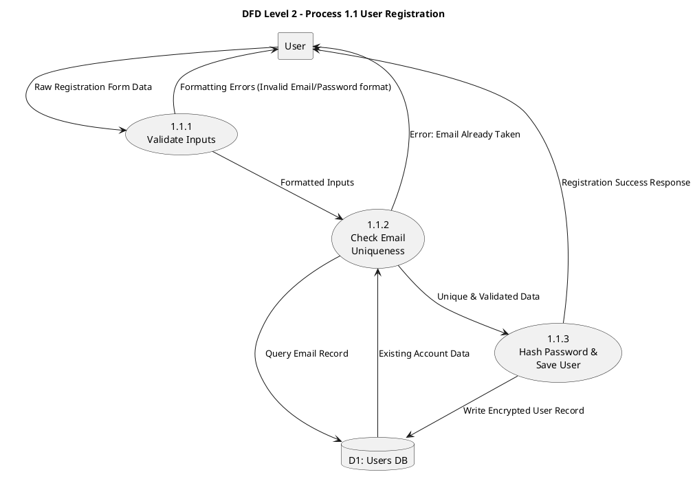

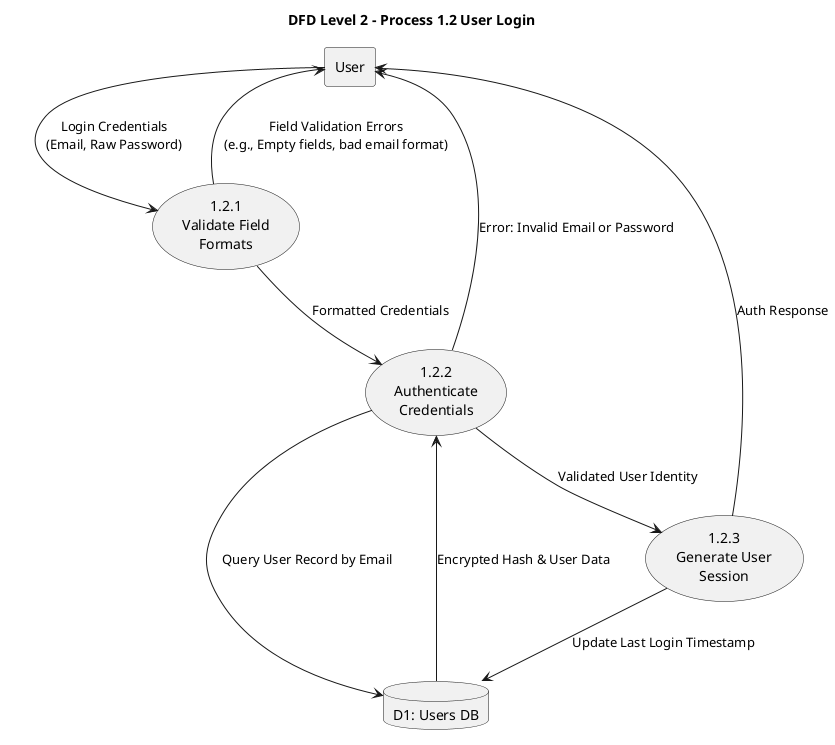

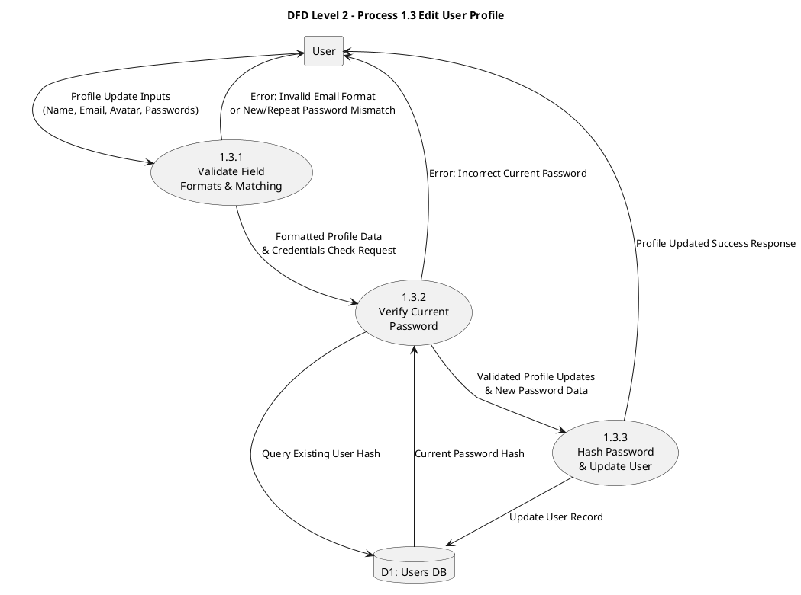
---
# Player Management
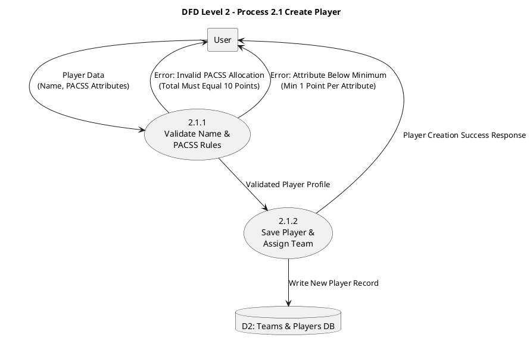

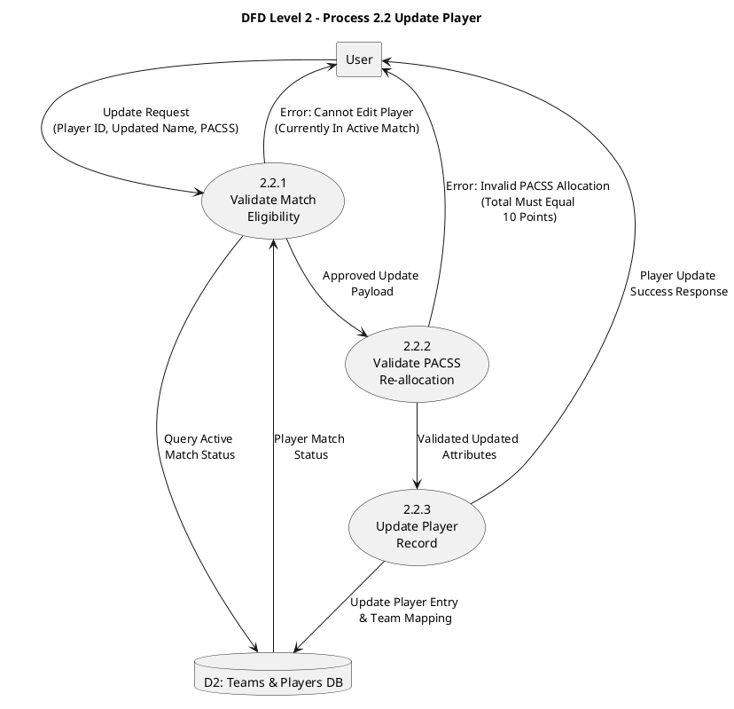

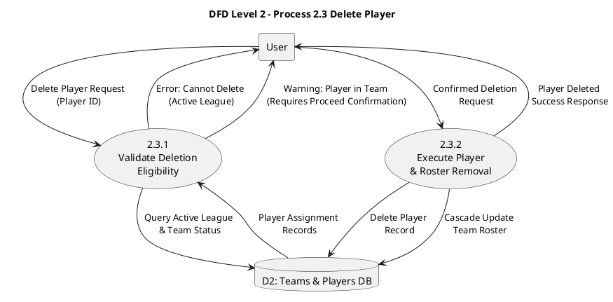
---
# Team Management

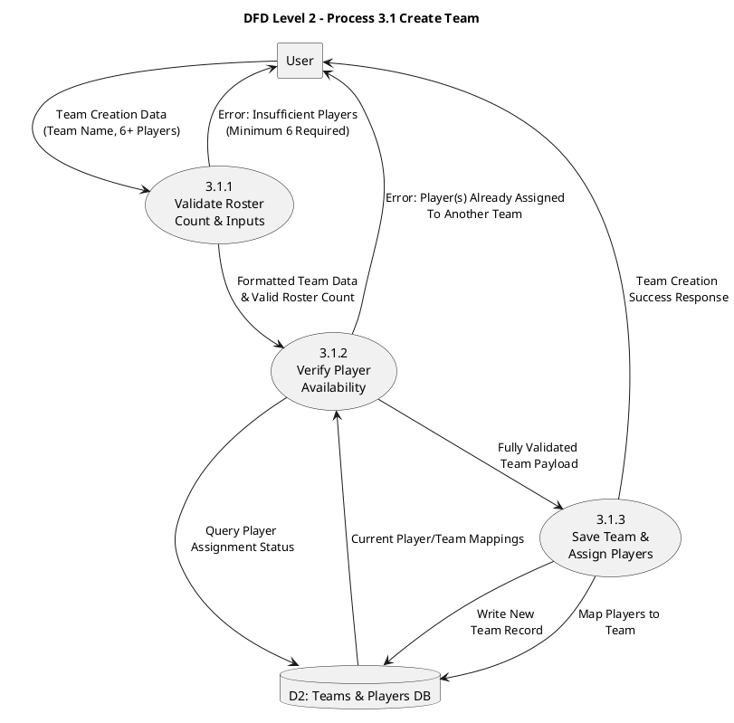

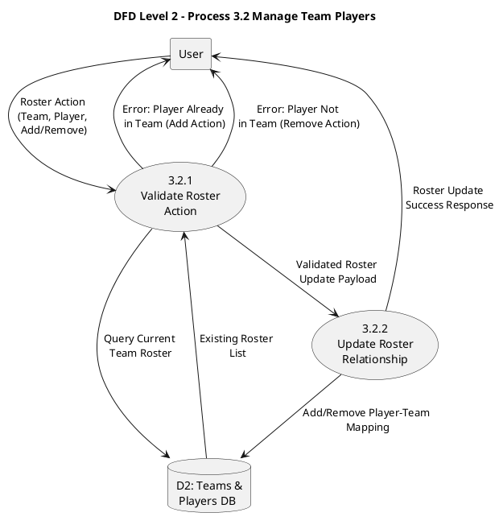

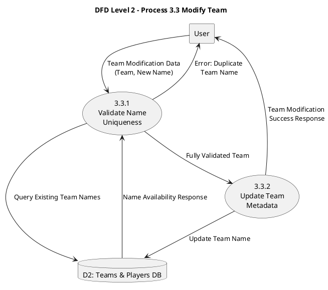
--- 
# Leagues Management

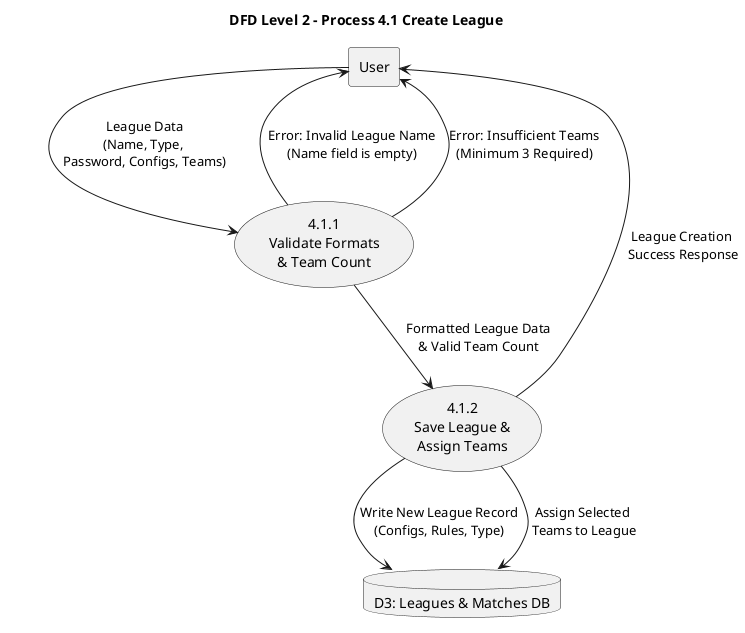
