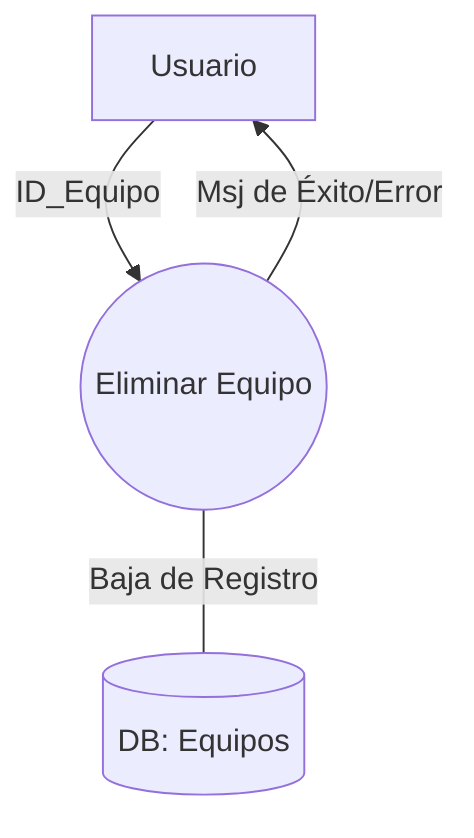
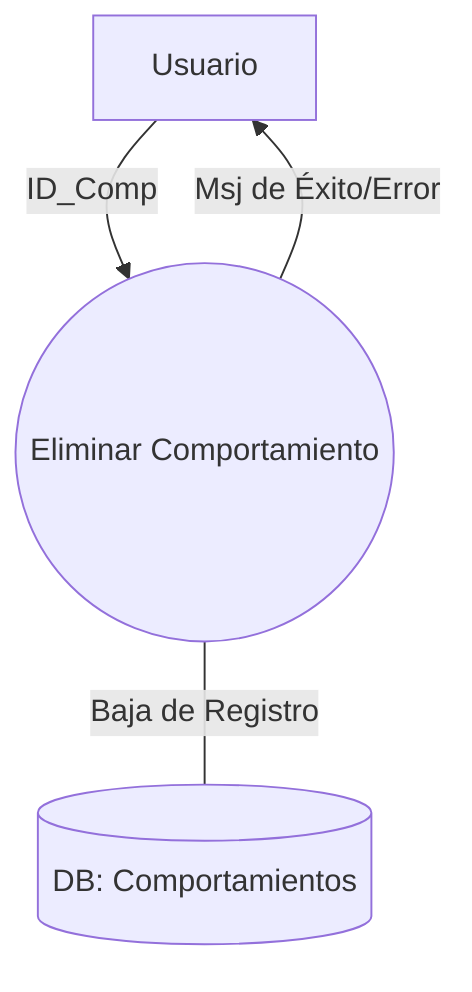
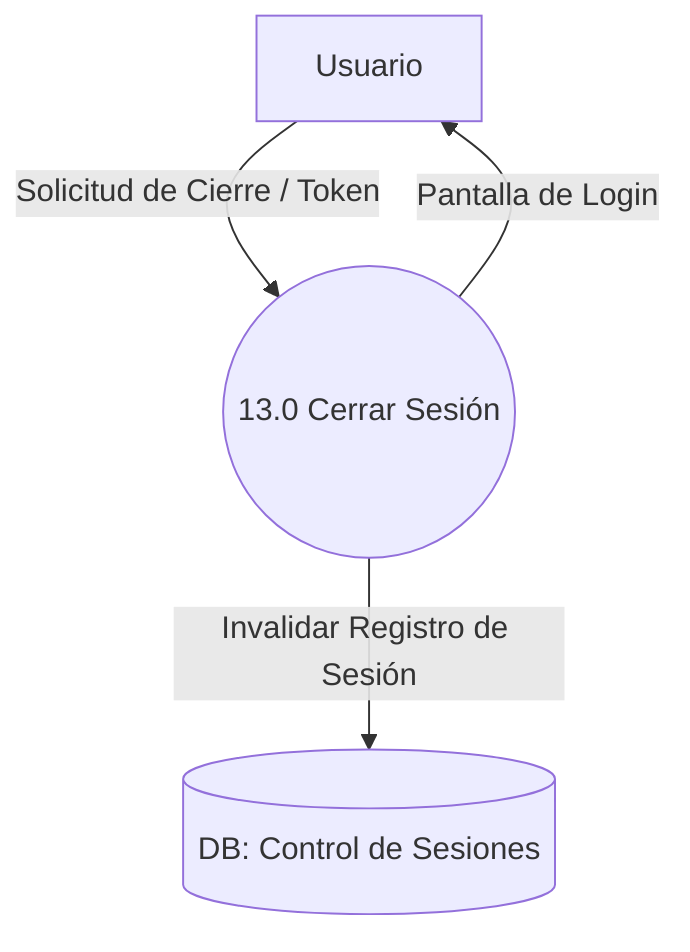
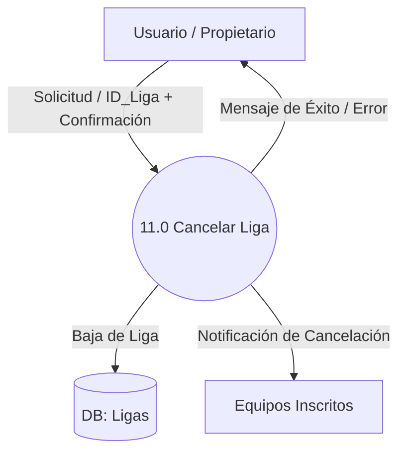

### Caso de uso #9: Eliminar equipo

**Descripcion:** Permite a un usuario remover un equipo existente del sistema.

| Atributo | Detalle |
|:---|:---|
|**Actor Primario**|Usuario |
|**Actor Secundario**|Sistema|
|**Precondicion**|El Usuario debe estar autenticado y debe existir al menos un equipo registrado en el sistema.|

#### Escenario Exitoso 

1. El Usuario selecciona el equipo que desea eliminar de la lista. 
2. El Usuario preciona el boton 'Eliminar Equipo'.
3. El Sistema solicita confirmacion para seguir con la accion.
4. El Usuario confirma la accion.
5. El Sistema elimina el equipo de la base de datos.
6. El Sistema muestra mensaje indicando la eliminacion exitosa del equipo.

#### Escenarios Excepcionales
* **3a. El Usuario Cancela la confirmacion:**
    1. El Sistema cancela la operacion sin modificar los datos.
    2. El Sistema regresa a la lista de equipos.
* **5a El Sistema no puede eliminar el equipo:**
    1. El Sistema detecta el fallo al intentar borrar el registro.
    2. El Sistema muestra un mensaje de error notificando que no se pudo eliminar el equipo.
    3. El equipo permanece registrado en el sistema 

#### DFD

### Caso de uso #11: Eliminar Comportamiento
**Descripcion:** Permite al Usuario remover un comportamiento del sistema.

| Atributo | Detalle |
|:---|:---|
|**Actor Primario**|Usuario|
|**Actor Secundario**|Sistema|
|**Precondicion**|El Usuario debe estar autenticado, debe existir al menos un comportamiento registrado en el sistema.|

#### Escenario Exitoso

1. El Usuario selecciona el comportamiento que desea eliminar de la lista. 
2. El Usuario preciona el boton 'Eliminar Comportamiento'.
3. El Sistema solicita confirmacion para seguir con la accion.
4. El Usuario confirma la accion.
5. El Sistema elimina el Comportamiento de la base de datos.
6. El Sistema muestra mensaje indicando la eliminacion exitosa del comportamiento.

#### Escenarios Excepcionales

* **3a. El Usuario Cancela la confirmacion:**
    1. El Sistema cancela la operacion sin modificar los datos.
    2. El Sistema regresa a la lista de comportamientos.
* **5a El Sistema no puede eliminar el equipo:**
    1. El Sistema detecta el fallo al intentar borrar el comportamiento de la Base de Datos.
    2. El Sistema muestra un mensaje de error notificando que no se pudo eliminar el Comportamiento.
    3. El Comportamiento permanece registrado en el sistema.
* **5b El Comportamiento elegido esta en uso**
    1. El Sistema detecta vinculo del comportamiento con un jugador activo.
    2. El Sistema muestra mensaje de error notificando que jugador/es estan usando dicho comportamiento.
    3. El Comportamiento permanece registrado en el sistema.

#### DFD

### Caso de uso #13: Cerrar sesion
**Descripcion:** Permite al usuario poder finalizar su sesion en el sistema.
| Atributo | Detalle |
|:---|:---|
|**Actor Primario**|Usuario|
|**Actor Secundario**|Sistema|
|**Precondicion**|El usuario debe estar logeado y estar en la ventana principal.|
#### Escenario Exitoso
1. El usuario hace click en el boton 'cerrar sesion'.
2. El sistema invalida la sesion actual.
3. El sistema limpia los datos locales y redirige directamente a la pantalla de inicio de sesion.

#### Escenario Excepcional
* **2a. La sesión ya había expirado (por inactividad):**
    1. El Sistema detecta que la sesión actual ya no es válida en el servidor.
    2. El Sistema limpia los datos locales y redirige directamente a la pantalla de inicio de sesión.

* **2b. Error de conexión con el servidor:**
    1. El Sistema no puede comunicarse con el servidor para invalidar la sesión remotamente.
    2. El Sistema fuerza el cierre de sesión de forma local por seguridad (borrando datos en el navegador/dispositivo).
    3. El Sistema redirige a la pantalla de inicio de sesión.

#### DFD

### Caso de uso #11: Cancelar liga

**Descripción:** Permite al usuario la oportunidad de cancelar una liga no empezada.

| Atributo | Detalle |
| :--- | :--- |
| **Actor Primario** | Usuario (Propietario de la liga) |
| **Actor Secundario** | Sistema |
| **Precondición** | El Usuario debe estar autenticado (logueado), debe ser el propietario de la liga a cancelar y la liga no debe haber empezado. |
| **Poscondición** | La liga es eliminada del sistema y los equipos inscritos son notificados de la cancelación. |

#### Escenario Exitoso
1. El Usuario hace clic en 'Cancelar liga'.
2. El Sistema solicita una confirmación al Usuario para proceder.
3. El Usuario confirma la cancelacion.
4. El Sistema cancela la liga de la base de datos.
5. El Sistema manda una notificación a los equipos que se habían inscrito.
6. El Sistema muestra un mensaje de éxito y redirige a la pantalla principal.

#### Escenarios Excepcionales / Alternativos
* **3a. El Usuario decide no confirmar la cancelación:**
    1. El Sistema cancela la operación sin hacer cambios en la base de datos.
    2. El Sistema redirecciona a la pantalla anterior.
* **4a. El Sistema no puede eliminar la liga (Fallo técnico):**
    1. El Sistema detecta un fallo al intentar procesar la baja en la base de datos.
    2. El Sistema muestra un mensaje de error indicando que no se pudo cancelar la liga en este momento.
    3. La liga permanece registrada en el sistema y no se envían notificaciones a los equipos.

#### DFD
